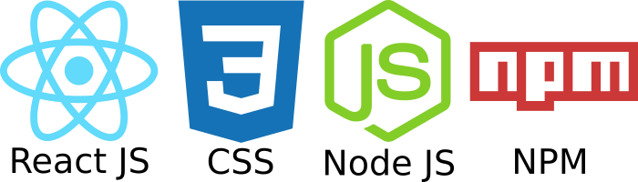
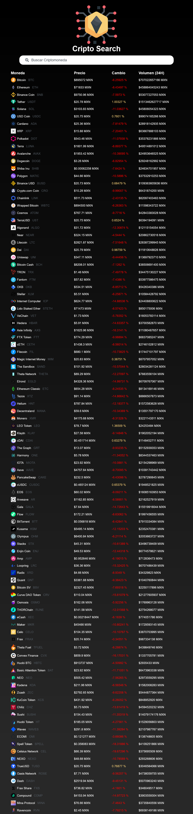

<div align="center">
   
   <h1>Cripto Search</h1
      
   <p>Este proyecto fue desarrollado con el API de <b>Coin Gecko</b> y la librería <b>Axios</b> y fue creado con la finalidad de poder mostrar el precio en pesos mexicanos de las criptomonedas más conocidas.</p>

   <a href="https://erikgiovani.github.io/cripto-search/">Ver Sitio</a>
</div>

<div align="center">
   <h2>Tecnologías</h2>
   
</div>

<div align="center">
   <h2>Escritorio</h2>
   
</div>

<div align="center">
   <h2>Instrucciones</h2>
   <p>Para poder iniciar este proyecto primero necesitas tener instalado <b>Node JS</b> y correr el siguiente comando desde la carpeta de este proyecto en la terminal.</p>
   
```
   npm install
```
   
<p>Para empezar este proyecto solo hay que correr el siguiente comando en la terminal.</p>
   
```
   npm start
```
   
<p>Para compilar este proyecto para producción necesitas correr el siguiente comando en la terminal.</p>

```
   npm run build
```
   
</div>

##
<div align="center">
   
</div>
